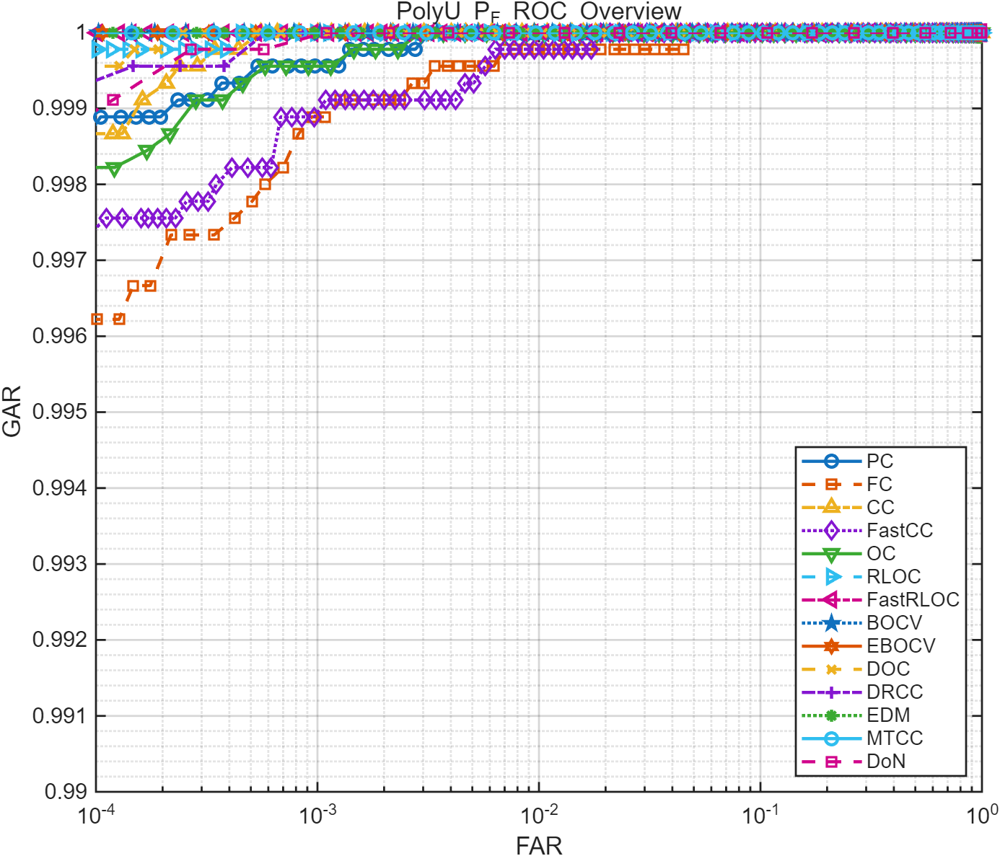

# Palmprint Recognition MATLAB

MATLAB reproduction of several classical palmprint recognition methods.

This repository contains a personal reimplementation of a set of classical palmprint recognition baselines for study and comparison. It is not an official release from the original paper authors, and method details should be checked against the corresponding papers when exact reproduction matters. For the Python version of this project, see [palmprint-recognition-python](https://github.com/Li-ChengYan/palmprint-recognition-python).

The repository focuses on the active evaluation path and one documented benchmark setting:

- score generation for genuine / imposter pairs
- ROC, EER, and score-distribution plotting
- a deterministic PolyU `P_F` benchmark over the first 100 identities

## Repository Layout

- `algorithm.m` - returns the filter, feature extractor, and matcher for a chosen algorithm
- `get_baseline.m` - computes genuine and imposter scores and saves them to a `.mat` file
- `PlotData.m` - loads a score file, computes EER, and plots the score distribution and ROC curve
- `demo_two_image_distance.m` - standalone demo that selects two images and outputs the PC distance
- `benchmark_polyu_subset.m` - runs the deterministic PolyU benchmark documented in this README
- `codeFunction/` - algorithm implementations
- `codeFunction/eval/` - evaluation helpers

## Requirements

- MATLAB R2025a or a compatible version
- Image Processing Toolbox
- For publicly available palmprint datasets, please refer to the information collected at [IAPR TC4 Palmprint Datasets](https://iapr-tc4.org/palmprint-datasets/), or search for the corresponding official dataset pages and access instructions.

## Quick Start

### 1. Generate genuine / imposter scores

Edit the configuration in `get_baseline.m`:

```matlab
projectRoot = fileparts(mfilename("fullpath"));
cfg = struct( ...
    "imgPath", fullfile(projectRoot, "path", "to", "dataset"), ...
    "imgForm", "png", ...
    "datasetType", "PolyU_CF", ...
    "algorithmName", "MTCC", ...
    "outputFile", fullfile(projectRoot, "data", "baseline", "PolyU_CF", "MTCC.mat") ...
);
```

Then run:

```matlab
get_baseline
```

The script saves `genuine` and `imposter` scores to `cfg.outputFile`.

### 2. Plot score distribution and ROC

Edit the score file path in `PlotData.m`:

```matlab
scoreFile = ".\data\baseline\PolyU\MTCC.mat";
plotTitle = "PolyU MTCC";
```

Then run:

```matlab
PlotData
```

The script loads the scores, computes EER, plots the score distribution, and plots the ROC curve.

### 3. Minimal distance demo

Run `demo_two_image_distance.m` directly.

For a non-interactive minimal example:

```matlab
projectRoot = fileparts(mfilename("fullpath"));
addpath(projectRoot);
addpath(fullfile(projectRoot, "codeFunction"));

img1 = uint8(ones(128) * 120);
img2 = uint8(ones(128) * 140);

[filterKernel, extractor, matcher] = algorithm("PC");
feature1 = extractor(img1, filterKernel);
feature2 = extractor(img2, filterKernel);
distance = matcher(feature1, feature2);

fprintf("PC distance: %.6f\n", distance);
```

### 4. Reproduce the benchmark

The benchmark below uses the first 100 identities from PolyU `P_F`, with 10 images per identity, for a total of 1000 images.

```matlab
projectRoot = fileparts(mfilename("fullpath"));
cfg = struct( ...
    "imgPath", fullfile(projectRoot, "path", "to", "PolyU"), ...
    "subsetCode", "F", ...
    "numClasses", 100, ...
    "imagesPerClass", 10, ...
    "outputFile", fullfile(projectRoot, "data", "benchmark", "polyu_pf_100ids_results.mat"), ...
    "rocOutputFile", fullfile(projectRoot, "data", "benchmark", "polyu_pf_100ids_roc_overview_refstyle.png") ...
);

benchmark_polyu_subset(cfg)
```

## Implemented Algorithms

The table below uses the usual method names, the repository code name, publication year, a short method summary, the template size / format from the paper, and a reference number sorted by publication year.

| Ref. | Year | Usual name | Code name | Method summary | Template size / format | EER (%) | d-prime | Extract (ms/img) | Match (ms/pair) |
| --- | ---: | --- | --- | --- | --- | ---: | ---: | ---: | ---: |
| [1] | 2003 | PalmCode | `PC` | Gabor filtering | 2 x 32 x 32, B | 0.049 | 7.067 | **1.341** | **0.258** |
| [2] | 2004 | CompCode | `CC` | Neural Gabor filtering with winner-take-all coding in six directions | 1 x 32 x 32, I | 0.028 | 6.411 | 7.053 | 0.606 |
| [3] | 2004 | FusionCode | `FC` | Gabor filtering at four directions, fusion strategy | 2 x 32 x 32, B | 0.110 | 5.718 | 9.088 | 0.901 |
| [4] | 2005 | OrdinalCode | `OC` | Gaussian filtering in 3 groups | 3 x 32 x 32, B | 0.051 | 7.455 | 2.590 | 0.682 |
| [5] | 2008 | RLOC | `RLOC` | Modified finite Radon transform filtering, six directions, competitive coding, pixel-to-area matching | 1 x 32 x 32, I | 0.021 | **9.143** | 7.120 | 9.159 |
| [6] | 2009 | BOCV | `BOCV` | Gabor filtering at six directions, fusion at score level | 6 x 32 x 32, B | **0.000** | 8.475 | 5.174 | 4.132 |
| [7] | 2012 | E-BOCV | `EBOCV` | Based on BOCV, fragile bit mask | 12 x 32 x 32, B | **0.000** | 8.194 | 7.526 | 14.722 |
| [8] | 2015 | Fast-CC | `FastCC` | Based on CompCode, using two directions only | 1 x 32 x 32, I | 0.104 | 6.473 | 2.752 | 0.675 |
| [8] | 2015 | Fast-RLOC | `FastRLOC` | Based on RLOC, using one-to-one matching | 1 x 32 x 32, I* | 0.001 | 5.315 | 7.072 | 0.744 |
| [9] | 2016 | DoN | `DoN` | 3D descriptor for 2D palmprint and ordinal measure | 3 x 128 x 128, I | 0.025 | 8.308 | 4.088 | 30.414 |
| [10] | 2016 | DOC | `DOC` | Based on CompCode, Top-2 competitive codes | 2 x 32 x 32, I | 0.021 | 6.857 | 7.248 | 2.296 |
| [11] | 2016 | DRCC | `DRCC` | Competitive code and neighbor ordinal feature | 1 x 32 x 32, I | 0.041 | 5.340 | 6.033 | 0.551 |
| [13] | 2020 | EDM | `EDM` | Optimizing downsampling | 6 x 32 x 32, B | 0.002 | 8.128 | 27.853 | 4.410 |
| [15] | 2023 | MTCC | `MTCC` | Multi-order Gabor features | 12 x 32 x 32, B | **0.000** | 8.141 | 8.714 | 8.638 |

Benchmark setting:

- Dataset: PolyU `P_F`
- Identities: first 100
- Images per identity: 10
- Total images: 1000
- Result files: `data/benchmark/polyu_pf_100ids_results.mat` and `data/benchmark/polyu_pf_100ids_roc_overview_refstyle.png`

The repository documents this benchmark setting only.

## ROC Overview

The overview below uses a log-scale FAR axis and a high-GAR display range to make small differences between strong methods easier to see.



## Notes

- The repository focuses only on the methods exposed by `algorithm.m`.
- `get_baseline.m` ships with a placeholder dataset path under `data/example_dataset`; update `cfg.imgPath` to the local dataset path before running it.
- `PlotData.m` expects a `.mat` file containing `genuine` and `imposter` scores.
- In the template size / format column, `B`, `I`, and `R` mean binary, integer, and real-valued templates, respectively.
- Fast-RLOC shares the same extractor family as RLOC, so the template shape is the same as RLOC.

## References

The reference numbers below are sorted by publication year, not by the original numbering in the source paper.

- `[1]` D. Zhang, W.-K. Kong, J. You, M. Wong, *Online palmprint identification*, IEEE Transactions on Pattern Analysis and Machine Intelligence, 2003.
- `[2]` A.-K. Kong, D. Zhang, *Competitive coding scheme for palmprint verification*, ICPR 2004.
- `[3]` A.W.-K. Kong, D. Zhang, *Feature-level fusion for effective palmprint authentication*, ICBA 2004.
- `[4]` Z. Sun, T. Tan, Y. Wang, S. Li, *Ordinal palmprint representation for personal identification*, CVPR 2005.
- `[5]` W. Jia, D.-S. Huang, D. Zhang, *Palmprint verification based on robust line orientation code*, Pattern Recognition, 2008.
- `[6]` Z. Guo, D. Zhang, L. Zhang, W. Zuo, *Palmprint verification using binary orientation co-occurrence vector*, Pattern Recognition Letters, 2009.
- `[7]` L. Zhang, H. Li, J. Niu, *Fragile bits in palmprint recognition*, IEEE Signal Processing Letters, 2012.
- `[8]` Q. Zheng, A. Kumar, G. Pan, *Suspecting less and doing better: New insights on palmprint identification for faster and more accurate matching*, IEEE Transactions on Information Forensics and Security, 2015.
- `[9]` Q. Zheng, A. Kumar, G. Pan, *A 3D feature descriptor recovered from a single 2D palmprint image*, IEEE Transactions on Pattern Analysis and Machine Intelligence, 2016.
- `[10]` L. Fei, Y. Xu, W. Tang, D. Zhang, *Double-orientation code and nonlinear matching scheme for palmprint recognition*, Pattern Recognition, 2016.
- `[11]` Y. Xu, L. Fei, J. Wen, D. Zhang, *Discriminative and robust competitive code for palmprint recognition*, IEEE Transactions on Systems, Man, and Cybernetics: Systems, 2016.
- `[13]` Z. Yang, L. Leng, W. Min, *Extreme downsampling and joint feature for coding-based palmprint recognition*, IEEE Transactions on Instrumentation and Measurement, 2020.
- `[15]` Z. Yang, L. Leng, T. Wu, M. Li, J. Chu, *Multi-order texture features for palmprint recognition*, Artificial Intelligence Review, 2023.
